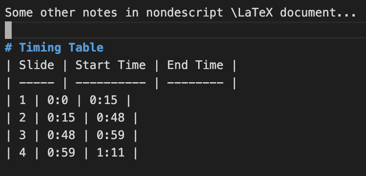
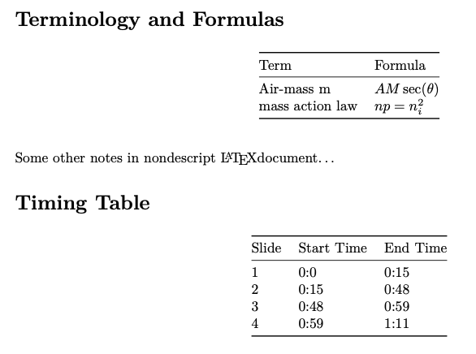
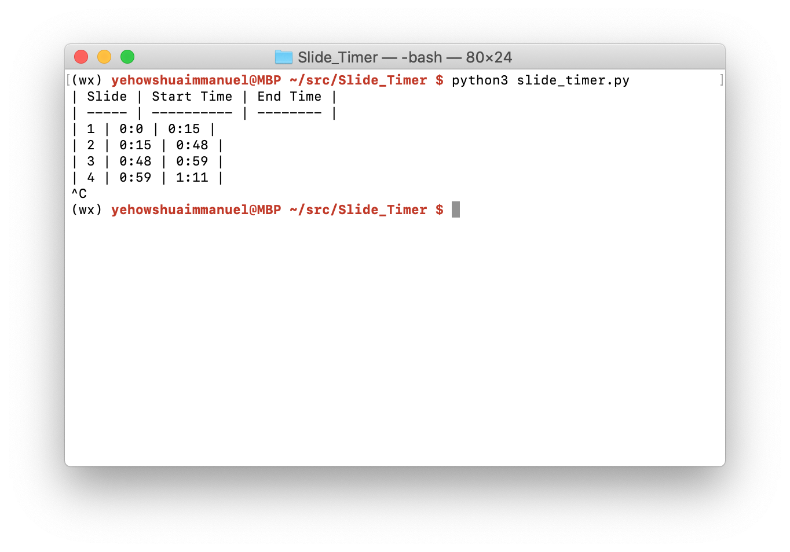
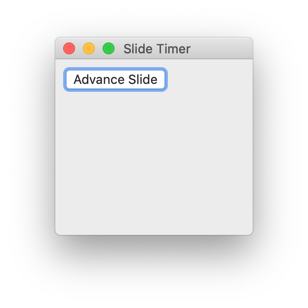

# Slider Timer
I usually take my notes in Mardown and convert them into LaTeX using pandoc.
Often in classes, I record lecture audio and would like to know what slide
was associated with what timestamp in the audio.

# Use
As the lecturer changes slides, click the advance slide button,
and the timestamp will be recorded in in markdown tabular form.
At the end of the lecture, close the Slide Timer app and copy and paste
the Mardown table from your terminal into your Mardown document.

# Dependencies
 - python3
 - wxpython